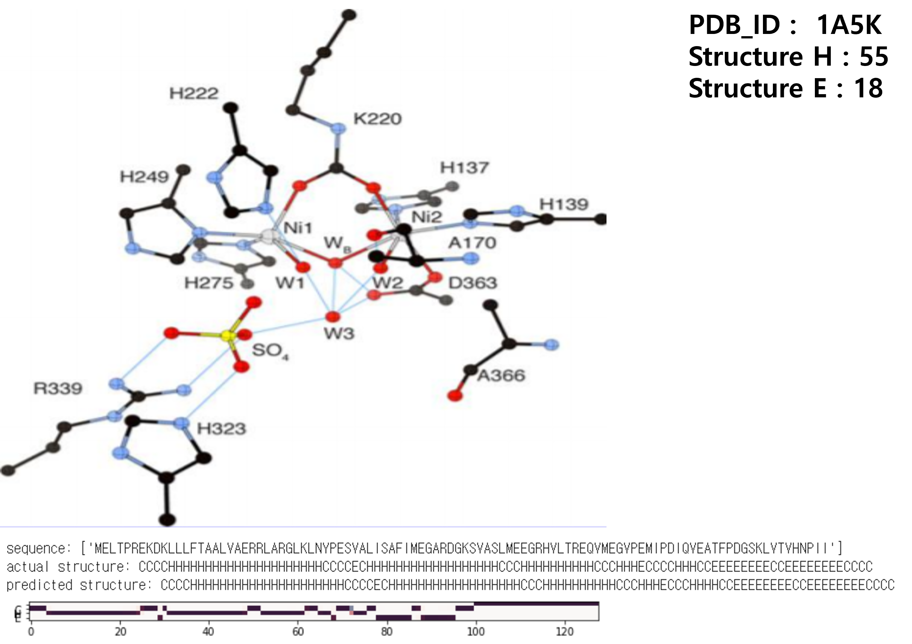
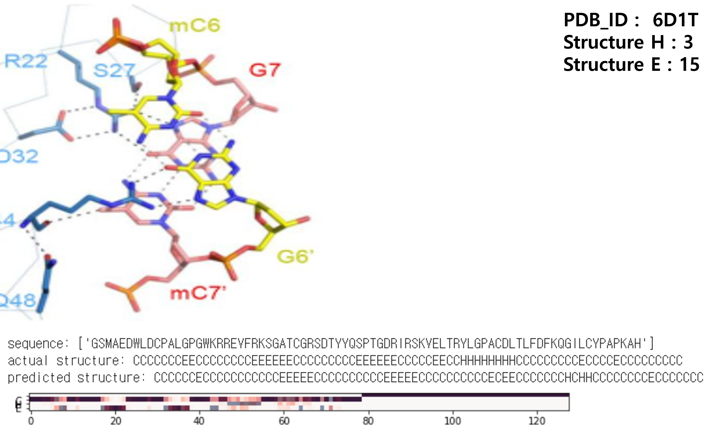

# 🧬 Protein Secondary Structure Prediction

> RNN · GRU · B-LSTM을 활용한 단백질 2차 구조 예측

<br>

## 📌 목차

- [프로젝트 개요](#-프로젝트-개요)
- [팀 구성](#-팀-구성)
- [기술 스택](#-기술-스택)
- [배경 및 목적](#-배경-및-목적)
- [데이터셋](#-데이터셋)
- [전처리](#-전처리)
- [모델 구조](#-모델-구조)
- [모델 비교 실험](#-모델-비교-실험)
- [하이퍼파라미터](#-하이퍼파라미터)
- [실험 결과](#-실험-결과)
- [한계점](#-한계점)
- [실행 방법](#-실행-방법)

<br>

## 📖 프로젝트 개요

<table>
  <thead>
    <tr>
      <th width="120" align="center">항목</th>
      <th>내용</th>
    </tr>
  </thead>
  <tbody>
    <tr>
      <td align="center">프로젝트명</td>
      <td>Protein Secondary Structure Prediction</td>
    </tr>
    <tr>
      <td align="center">개발 기간</td>
      <td>2019년 2학기</td>
    </tr>
    <tr>
      <td align="center">개발 인원</td>
      <td>4명</td>
    </tr>
    <tr>
      <td align="center">프로젝트 소개</td>
      <td>
        단백질 2차 구조는 형태에 따라 단백질의 기능이 달라지며, 바이오 분야에서 2차 구조 예측 실험은 비용이 매우 높다.<br>
        본 프로젝트는 아미노산 시퀀스 데이터를 딥러닝 모델(RNN, GRU, B-LSTM)로 학습하여 단백질 2차 구조를 예측하고,<br>
        각 모델의 정확도와 손실률을 비교·분석한다.
      </td>
    </tr>
  </tbody>
</table>

<br>

## 👥 팀 구성

<table>
  <thead>
    <tr>
      <th width="120" style="text-align:center">이름</th>
      <th style="text-align:center">작업</th>
    </tr>
  </thead>
  <tbody>
    <tr>
      <td align="center">채윤재</td>
      <td>모델 학습 및 파라미터 조정 - B-LSTM, RNN, GRU</td>
    </tr>
    <tr>
      <td align="center">정지범</td>
      <td>데이터 전처리, 모델 학습 - B-LSTM, RNN, GRU</td>
    </tr>
    <tr>
      <td align="center">김은선</td>
      <td>데이터 전처리, 모델 학습 - B-LSTM, RNN, GRU</td>
    </tr>
    <tr>
      <td align="center">김은주</td>
      <td>프로젝트 주제 선정, 배경 조사</td>
    </tr>
  </tbody>
</table>

<br>

## 🛠 기술 스택

| 분류 | 기술 |
|------|------|
| 언어 |  |
| 개발환경 |   |
| 프레임워크 |   |
| GPU |  -F9AB00?style=flat-square&logoColor=white) |
| 모델 |    |
| 데이터셋 |  |

<br>

## 🎯 배경 및 목적

- 단백질은 생명 활동에 중요한 기능을 담당하며, 2차 구조의 형태에 따라 기능이 달라진다
- 바이오 분야에서 2차 구조 예측 실험은 비용이 매우 높다
- 3차 구조 예측 전 2차 구조를 먼저 예측하여 아미노산 시퀀스를 분석한다
- 딥러닝 모델을 활용해 정확도를 높이고 손실률을 낮추는 것을 목표로 한다
- 새로운 아미노산 시퀀스 데이터를 테스트하여 예측값과 실제 구조값을 비교한다

<br>

## 📊 데이터셋

- **출처**: [Kaggle - Protein Secondary Structure](https://www.kaggle.com/alfrandom/protein-secondary-structure#2018-06-06-pdb-intersect-pisces.csv)
- **학습 방식**: Supervised Learning (시퀀스 → SST3 레이블)

**주요 컬럼:**

| 컬럼 | 설명 |
|---|---|
| pdb_id | 단백질 DB ID |
| seq | 아미노산 시퀀스 |
| sst8 | 8가지 2차 구조 분류 |
| sst3 | 3가지 2차 구조 분류 (H/E/C) |
| len | 시퀀스 길이 |

**SST8 → SST3 분류 변환:**

| SST3 | SST8 | 설명 |
|---|---|---|
| H | H, G, I | Helix 계열 |
| E | E, B | Strand 계열 |
| C | S, T, X | Coil 계열 |

**데이터 분포:**

| 분류 | 개수 |
|---|---|
| Train | 5,112 |
| Validation | 1,988 |
| Test | 455 |
| **Total** | **7,099** |

<br>

## ⚙️ 전처리

**SEQ (아미노산 시퀀스) 전처리:**

```
아미노산 시퀀스 문자열
  → Word Embedding (One-hot encoding → Dense vector)
  → 입력 길이 128로 패딩
```

**SST3 레이블 전처리:**

```
C → 1, H → 2, E → 3
  → One-hot encoding
    C: [1,0,0,0]
    H: [0,1,0,0]
    E: [0,0,1,0]
```

<br>

## 🤖 모델 구조

### B-LSTM (Bidirectional LSTM)

단방향 LSTM과 달리 순방향·역방향 두 방향으로 시퀀스를 학습하여 문맥 정보를 풍부하게 활용한다.

```
Input (아미노산 시퀀스)
  → Embedding (input_dim=8421, output_dim=4, input_length=128)
  → Bidirectional LSTM (units=64, return_sequences=True, recurrent_dropout=0.1)
  → TimeDistributed Dense (output_dim=4, activation=softmax)
  → Output (SST3 예측: H / E / C)
```

**TimeDistributed Dense:** 각 타임스텝마다 독립적으로 Dense를 적용하여 시퀀스의 각 위치별 구조를 예측한다.

<br>

## 📈 모델 비교 실험

| 모델 | SST3 Loss | SST3 Accuracy | 학습 시간(분) |
|---|:---:|:---:|:---:|
| RNN | 23% | 86% | 63 |
| GRU | 20% | 89% | 135 |
| **B-LSTM** | **18%** | **93%** | 230 |

> B-LSTM이 가장 높은 정확도(93%)와 가장 낮은 손실률(18%)을 기록하였다.

<br>

## 🔧 하이퍼파라미터

| 레이어 | 파라미터 | 값 |
|---|---|---|
| Embedding | input_dim | 8421 |
| | output_dim | 4 |
| | input_length | 128 |
| Bidirectional LSTM | units | 64 |
| | return_sequences | True |
| | recurrent_dropout | 0.1 |
| TimeDistributed Dense | output_dim | 4 |
| | activation | softmax |
| Compile | optimizer | rmsprop |
| | loss | categorical_crossentropy |
| Fit | batch_size | 128 |
| | epochs | 20 |

<br>

## 🖥 실험 결과

### PDB_ID: 1A5K

**Structure H : 55 / Structure E : 18**



### PDB_ID: 6D1T

**Structure H : 3 / Structure E : 15**



<br>

## ⚠️ 한계점

- **데이터의 중복성**: 데이터셋 내 중복 시퀀스로 인해 모델의 일반화 성능에 영향을 줄 수 있음
- **모델 신뢰성**: 참고한 코드의 오류로 인해 모델의 신뢰성이 일부 하락함

<br>

## 🚀 실행 방법

### 1. 레포 클론

```bash
git clone https://github.com/GroovyCat/Protein_Secondary_Structure_Prediction.git
cd Protein_Secondary_Structure_Prediction
```

### 2. 의존성 설치

```bash
pip install tensorflow==1.14 keras==2.1 numpy pandas jupyter
```

### 3. 데이터셋 준비

[Kaggle 데이터셋](https://www.kaggle.com/alfrandom/protein-secondary-structure#2018-06-06-pdb-intersect-pisces.csv)에서 다운로드 후 프로젝트 폴더에 위치

### 4. 노트북 실행

```bash
jupyter notebook
```

- `RNN.ipynb` → RNN 모델 학습 및 평가
- `GRU.ipynb` → GRU 모델 학습 및 평가
- `BLSTM.ipynb` → B-LSTM 모델 학습 및 평가
